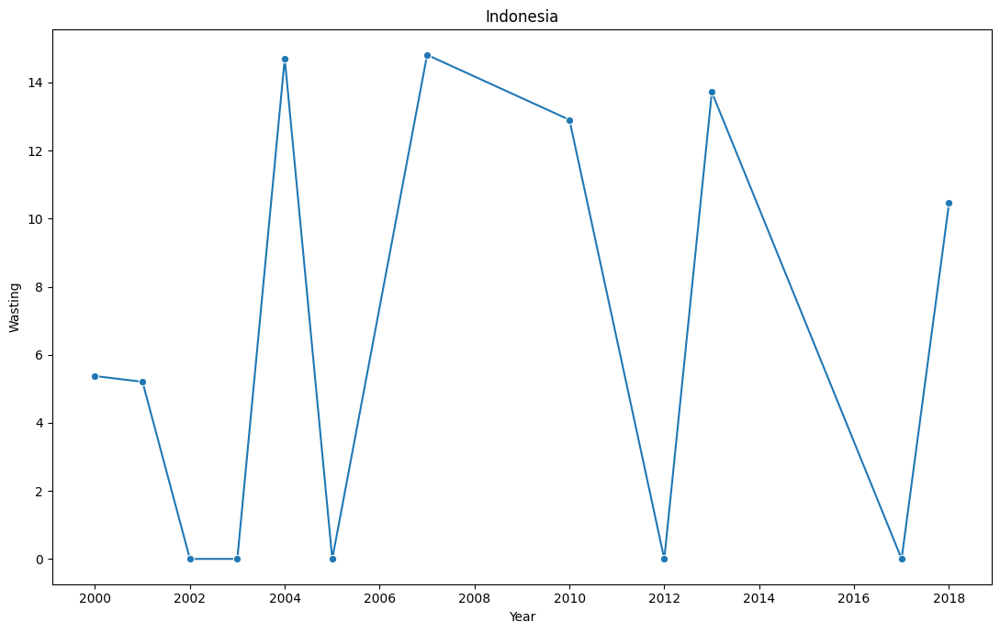

# Laporan Proyek Machine Learning - Tsaqif Mutashim Mufid

## Domain Proyek

*Stunting* telah menjadi program nasional di Indonesia karena masih melibatkan sebagian besar penduduk. Upaya pencegahan *stunting* memerlukan pemahaman mendalam terhadap faktor-faktor yang menjadi determinan, baik dari pihak ibu maupun anak. Faktor ibu yang menjadi determinan *stunting* melibatkan pendidikan ibu, kesadaran dalam mengonsumsi tablet tambah darah, menjaga kualitas makanan, serta kemampuan dalam mencari informasi gizi baik dari sumber-sumber terpercaya [1]. Selain itu, faktor anak yang juga determinan *stunting* melibatkan kurangnya asupan ASI dan MPASI, terutama ketika ibu mengalami kekurangan gizi. Dengan kondisi tersebut, tumbuh kembang anak menjadi terhambat, menyebabkan kejadian *stunting* [2]. *Stunting* merupakan masalah gizi utama di negara-negara berkembang, termasuk Indonesia. *Stunting* dapat terjadi pada anak setelah usia 6 bulan, dan semua anak membutuhkan makanan lunak yang bergizi, umumnya dikenal sebagai makanan pendamping ASI (MP-ASI), selain ASI. Ada berbagai faktor yang dapat menyebabkan *stunting*, seperti kurangnya pemberian ASI eksklusif, rendahnya kadar kalsium dalam ASI, dan gumoh yang berlebihan setelah menyusui. *Stunting* merupakan kondisi gagal tumbuh pada anak balita akibat kekurangan gizi kronis terutama dalam 1.000 hari pertama kehidupan sehingga anak terlalu pendek untuk usianya [3]. Penelitian telah menunjukkan bahwa pemberian ASI eksklusif secara signifikan berhubungan dengan risiko stunting yang lebih rendah [4] [2]. Dalam upaya menurunkan angka *stunting*, khususnya praktik malnutrisi pada anak telah banyak dilakukan seminar yang bertujuan untuk mendiskusikan peran penting pertumbuhan ekonomi keluarga [5]. Faktor ekonomi merupakan jumlah pendapatan yang diperoleh keluarga untuk memenuhi keperluan rumah tangga [3]. Selain itu, *stunting* masih menjadi masalah yang serius di Indonesia, dengan prevalensi *stunting* pada tahun 2022 sebesar 21,6% [6]. Hal ini berbeda dengan target WHO, yang harus di bawah 20% [7]. Oleh karena itu, pemanfaatan pembelajaran mesin diharapkan dapat membantu memprediksi dan mencegah malnutrisi pada anak.

**References**:
> [1]	I. R. Putri and M. Anas, “Hubungan Faktor Ibu Dan Anak Terhadap Kejadian Stunting Pada Balita,” J. Multidisiplin Indones., vol. 2, no. 7, pp. 1450–1469, Jul. 2023, doi: 10.58344/jmi.v2i7.304.

> [2]	A. K. S. Lebuan, M. Syafar, and N. Hartati, “Hubungan Pola Pemberian Makan Pada Balita Stunting di Puskesmas di Flores Timur”.

> [3]	E. M. Yanti, “HUBUNGAN FAKTOR EKONOMI DAN POLA ASUH ORANG TUA DENGANKEJADIAN STUNTING PADA BALITA DI DESA KEMBANG KERANG DAYA,” vol. 4, no. 8, 2023.

> [4]	R. S. Putra Pratama, M. S. Dasuki, T. Agustina, and S. Soekiswati, “ASI Eksklusif Sebagai Faktor Protektif Terhadap Kejadian Stunting Pada Balita 24-59 Bulan,” J. Ilm. Kesehat. Sandi Husada, vol. 11, no. 1, pp. 262–270, Jun. 2022, doi: 10.35816/jiskh.v11i1.748.

> [5]	E. Endraria and P. Susilo, “Edukasi Mengenai Pertumbuhan Ekonomi Keluarga Yang Efektif Dapat Menurunkan Angka Stunting Khususnya Praktik Malnutrisi Pada Anak,” J. Pengabdi. Masy. Bangsa, vol. 1, no. 8, pp. 1580–1588, Oct. 2023, doi: 10.59837/jpmba.v1i8.390.

> [6]	H. T. Sinaga, N. Achmad, M. Manalu, S. Perangin-Angin, and L. G. Doloksaribu, “Length Attainment and Stunting Prevalence of Children aged 0–24 Months Living in the Area of Clay Brick Kilns in Pagar Merbau Sub District, Indonesia,” Open Access Maced. J. Med. Sci., vol. 10, no. E, pp. 155–160, Jan. 2022, doi: 10.3889/oamjms.2022.7969.

> [7]	A. J. Pitoyo, A. Saputri, R. E. Agustina, and T. Handayani, “Analysis of Determinan of Stunting Prevalence among Stunted Toddlers in Indonesia,” Populasi, vol. 30, no. 1, p. 36, Jun. 2022, doi: 10.22146/jp.75796.

## Business Understanding

Hakikatnya, generasi muda membutuhkan pemahaman mendalam mengenai faktor-faktor yang dapat menyebabkan *stunting* pada anak sebagai bekal penting dalam menghadapi kehidupan mendatang. Generasi Z, sering disebut sebagai anak-anak muda, masih memiliki pengetahuan terbatas mengenai *stunting*. Beberapa mulai menyadari masalah ini karena menjadi perbincangan umum di televisi. Hal ini menjadi motivasi bagi penulis untuk membantu calon orang tua agar lebih memperhatikan aspek gizi anak-anak mereka, termasuk pemahaman tentang faktor-faktor yang dapat memicu *stunting*.

Harapannya dengan adanya pemahaman faktor - faktor tersebut dapat meningkatkan kesejahteraan masyarakat secara menyeluruh dan dapat mengurangi angka kasus *stunting* di kalanagan anak - anak. Hal ini akan memberikan dampak positif pada generasi masa depan untuk meningkatkan kualitas hidup dan membentuk masyarakat yang lebih sehat secara keseluruhan. Selain itu juga, mengurangi tingkat *stunting* dapat berkontribusi pada penurunan beban kesehatan masyarakat dan peningkatan produktivitas di masa mendatang. 

Pemanfaatan teknologi pembelajaran mesin menjadi bagian penting dari solusi ini. Dengan menerapkan teknologi ini, kita dapat menganalisis data yang kompleks terkait stunting pada anak. Pembelajaran mesin membantu dalam memprediksi risiko stunting dan menciptakan sistem yang mendukung orang tua serta tenaga kesehatan. Semua ini diharapkan tidak hanya meningkatkan pemahaman, tetapi juga membantu mengurangi kasus *stunting* sebesar 3,8% setiap tahunnya.

### Problem Statements

Dengan latar belakang permasalahan yang diungkapkan, muncul pertanyaan-pertanyaan yang relevan terkait aspek penting dalam perawatan kehamilan, terutama berkaitan dengan pengaturan pola makan ibu hamil untuk memastikan asupan gizi yang optimal. Beberapa pertanyaan yang diajukan untuk merumuskan pemahaman lebih mendalam melibatkan:
> **Bagaimana hubungan antara pola makan seorang ibu hamil dan risiko stunting pada anak yang dikandungnya?**

> **Apakah ada korelasi antara faktor-faktor terkait gizi dalam makanan ibu hamil dan kemungkinan terjadinya stunting pada anak?**

> **Adakah metode atau langkah-langkah yang dapat diambil untuk memastikan pemenuhan gizi yang optimal selama kehamilan, dengan tujuan mencegah kasus stunting pada anak yang dilahirkan?**

### Goals

Untuk menjawab dari permasalahan sebelumnya, penulis mencoba membuat predictive analysis dengan tujuan atau goals sebagai berikut:
> **Mengidentifikasi dan menganalisis hubungan antara pola makan ibu hamil dengan risiko stunting pada anak yang sedang dikandungnya**

> **Mengetahui korelasi antara faktor-faktor gizi dalam makanan ibu hamil dan potensi terjadinya stunting pada anak yang dilahirkan.**

> **Membuat model predictive analysis yang dapat memprediksi tingkat risiko stunting pada anak berdasarkan faktor-faktor gizi dalam makanan ibu hamil, dengan tingkat akurasi yang tinggi.**

## Data Understanding
Pada kasus ini penelitian difokuskan pada dataset resmi UNICEF yang berisi data terkait kasus stunting. Dataset ini dapat diakses melalui [UNICEF](https://sdmx.data.unicef.org/databrowser/index.html?q=UNICEF:NUTRITION(1.0)).

Walaupun dataset tersebut mencakup berbagai variabel, penelitian ini memusatkan fokus pada beberapa variabel tertentu untuk mengidentifikasi batasan dan distribusi data yang relevan. Karena dataset bersifat mentah atau belum terstruktur, langkah awal yang harus diambil adalah melakukan pembersihan data. Proses ini melibatkan tahapan mengolah data yang kotor menjadi data yang bersih.

Sebelumnya kita akan memuat dataset yang sudah kita peroleh menggunakkan library pandas.
```sh
import pandas as pd
data = pd.read_csv('Nutritions.csv')
```
Hasil dari pemrosesan code diatas dapat dilihat pada Gambar 1

Gambar 1. Data Loading

Pada Gambar 1 disajikan data yang berisikan dataset asli sebelum dilakukan tahap pengolahan data. Setelah dimuat, terlihat bahwa data dari UNICEF masih dalam kondisi yang perlu diperbaiki. Selanjutnya, akan dilakukan penelusuran kondisi data menggunakan fungsi info().
```sh
data.info()
```

Gambar 2. Data Information

Berdasarkan Gambar 2, disajikan sumber informasi data yang mencakup jumlah kolom, tipe data, dan besaran data pada setiap kolomnya.

Dengan banyaknya variabel fitur, hanya akan dipilih beberapa variabel tertentu agar cakupan yang ditelusuri sesuai dan tidak terlalu meluas. Dalam menentukan variabel yang akan diekstraksi, akan menggunakan parameter fungsi dari pandas, yaitu *chunksize*. Sesuai dengan kondisi kasus ini, di mana dataset cukup besar dan kompleks, langkah ini perlu dilakukan untuk memproses data secara bertahap, sehingga memastikan hasilnya tidak memakan waktu yang terlalu lama. Variabel fitur yang akan diekstraksi akan dilakukan manipulasi string agar data lebih mudah dibaca, meliputi :


| Feature Selection                         | Result             | Data Understanding                                                                                                                                                                                                                                                                                                                                                       |
| ----------------------------------------- | ------------------ | ------------------------------------------------------------------------------------------------------------------------------------------------------------------------------------------------------------------------------------------------------------------------------------------------------------------------------------------------------------------------ |
| REF_AREA:Geographic area                  | Country            | `Merupakan data geografis yang disajikan pada dataset dalam kasus ini area 'Indonesia' menjadi target.`                                                                                                                                                                                                                                                                  |
| INDICATOR:Indicator                       | Indicator          | `Merupakan data yang mencakup sejumlah indikator yang beragam terkait dengan status gizi anak, mencakup aspek-aspek seperti pemberian ASI, pertumbuhan fisik, pola makan, dan cakupan suplementasi. Indikator ini melibatkan kategorisasi seperti tingkat stunting, wasting, overweight, serta informasi terkait dengan praktik pemberian makanan dan gizi sejak lahir.` |
| SEX:Sex                                   | Gender             | `Merupakan data yang mengidentifikasi jenis kelamin individu dan mencakup tiga kategori: 'Male', 'Female', dan 'Total'. Kategori 'Total' mungkin merujuk pada total keseluruhan populasi atau total dari suatu kelompok tertentu.`                                                                                                                                       |
| AGE:Current age                           | Age                | `Merupakan data yang mencerminkan informasi tentang usia individu dalam dataset. Variabel ini dirancang untuk menggambarkan variasi usia di antara subjek data. Analisis terhadap variabel ini dapat memberikan wawasan tentang distribusi usia dalam dataset, memungkinkan identifikasi tren atau pola yang mungkin berkaitan dengan kelompok usia tertentu`            |
| WEALTH_QUINTILE:Wealth Quintile           | Poverty_Rating     | `Merupakan data yang mencakup informasi tentang klasifikasi kekayaan individu atau rumah tangga dalam dataset. Kelompok kekayaan ini dibagi menjadi beberapa kategori atau quintile, mencerminkan tingkat kekayaan yang berbeda.`                                                                                                                                        |
| RESIDENCE:Residence                       | Residence          | `Merupakan data yang mencakup informasi tentang lokasi tempat tinggal individu atau rumah tangga dalam dataset. Variabel ini mungkin menggambarkan beragam tipe tempat tinggal atau wilayah geografis tanpa merinci setiap kategori secara spesifik.`                                                                                                                    |
| MATERNAL_EDU_LVL:Mother's Education Level | Maternal_Education | `Merupakan data yang memuat informasi mengenai tingkat pendidikan ibu dari individu atau anak dalam dataset. Variabel ini mungkin mengelompokkan tingkat pendidikan menjadi beberapa kategori umum.`                                                                                                                                                                     |
| TIME_PERIOD:Time period                   | Year               | `Merupakan data yang mencakup informasi tentang periode waktu yang terkait dengan data dalam dataset. Variabel ini mungkin mencerminkan rentang waktu atau tanggal pengumpulan data tanpa merinci periode waktu secara spesifik.`                                                                                                                                        |
| OBS_VALUE:Observation Value               | Observation_Value  | `Merupakan data yang memuat informasi tentang nilai observasi yang terkait dengan data dalam dataset. Variabel ini mungkin mencakup beragam nilai dari 0-100.`                                                                                                                                                                                                           |


Gambar 3. String Variable Feature

Pada gambar 3, data masih berjenis string, sehingga data tersebut belum dapat diolah lebih lanjut. Oleh karena itu, setelah dilakukan manipulasi string pada variabel fitur, langkah berikutnya adalah mencoba mengonversi data ke dalam bentuk dataframe agar memungkinkan pemrosesan lebih lanjut. Berikut hasil konversi kedalam bentuk dataframe bisa dilihat pada Gambar 4.

Gambar 4. Dataframe Dataset

Sebelumnya, tipe data pada variabel fitur 'Year' masih dalam bentuk 'integer'. Proses konversi tipe data dilakukan menjadi 'datetime' dengan menggunakan fungsi `pd.to_datetime(df['Year'], format='%Y')`. Hal ini bertujuan untuk memungkinkan analisis tren kondisi yang sedang terjadi, perubahan tersebut menggunakan fungsi `df.info()` yang dapat dilihat pada Gambar 5.

Gambar 5. Informasi Data

Pada Gambar 5, disajikan sebuah informasi variabel fitur, tipe data, dan jumlah data sebesar 10959.

Setelah data menjadi lebih mudah dibaca, langkah selanjutnya adalah memeriksa apakah dataset yang telah dibersihkan memiliki nilai duplikat dengan menggunakan fungsi `df.duplicated().sum()`. Pada tahap ini, juga dilakukan evaluasi terhadap keberadaan nilai null dalam data menggunakan fungsi `df.isnull()` seperti pada Gambar 6

Gambar 6. Data Null dan Duplicated

Seperti yang terlihat pada Gambar 6, data yang telah melalui tahap pemrosesan tidak menunjukkan adanya nilai *null* maupun *duplicated*.

Selanjutnya, akan dilakukan penelusuran lebih lanjut terhadap variabel "Indicator". Pemilihan variabel ini didasarkan pada relevansinya dengan literatur yang telah dilampirkan pada data di atas diataranya:
- Ever breastfed (0-23 months)
- Continued breastfeeding (12-15 months)
- Continued breastfeeding (12-23 months)
- Continued breastfeeding (20-23 months)
- Introduction to solid, semi-solid foods (6-8 months)
- Minimum meal frequency (children aged 6 to 23 months)
- Mean BMI-for-age
- Height-for-age <-2 SD (stunting)
- Weight-for-age <-2 SD (Underweight)
- Weight-for-height <-2 SD (wasting)
- Weight-for-height <-3 SD (severe wasting)
- Weight-for-height >+2 SD (overweight)
- Vitamin A Supplementation, two-dose coverage
- Prevalence of low birth weight among new-borns

Hasil seleksi fitur variabel yang terdapat pada kolom "Indicator" terlihat pada Gambar 7.

Gambar 7. Hasil Seleksi Fitur Indicator

Pada Gambar 7 disajikan informasi dataset yang terbaru yang sudah dilakukan tahap seleksi fitur yang menghasilkan jumlah data di awal sebesar 10959 menjadi 2159. Hal ini juga didukung ketika menggunakan fungsi `.shape` yang tertera pada Gambar 8

Gambar 8. Jumlah Dataframe Dataset Terbaru

Karena masih terdapat nilai yang mengindikasikan total, dilakukan manipulasi string lagi untuk mendapatkan informasi yang lebih terstruktur, mulai dari `Residence`, `Maternal_Education`, hingga `Poverty_Rating`.

Value dari `Residence` meliputi *Total*, *Rural*, *Urban*. Nilai total akan diubah menjadi *Suburban*, mengikuti informasi dari tempat tinggal di Indonesia agar distribusi data menjadi lebih terukur. Hasil pemrosesan tersebut bisa dilihat pada Gambar 9.

Gambar 9. Distrubusi Data Residence

Berikutnya value dari `Maternal_Education` pun akan dikelompokkan menjadi 4 subset dari 7 yaitu:
1. *No education*
2. *Primary education*
3. *Secondary education*
4. *Tertiary education*

Hasil pemrosesan tersebut juga dapat dilihat pada Gambar 10.

Gambar 10. Distribusi Data Maternal Education

Selanjutnya pada tahap `Poverty_Rating` sebelum dilakukannya analisis terhadap variabel antar variabel pun akan dikelempokkan menjadi 3 kategori yaitu *Poor*, *Middle Class*, *Rich*. Hasil tersebut dapat dilihat pada Gambar 11.

Gambar 11. Distribusi Data Poverty Rating

Terakhir kita akan menyimpan data dataset yang baru dengan menggunakan code dibawah ini
```sh
nutri_indo.to_csv('Nutrition_Indonesia.csv', index=False)
```

## Data Preparation

Teknik data preparation yang telah dilakukan pada tahap Data Understanding mencakup pembersihan data (Cleaning Data), pemilihan fitur (Feature Selection), manipulasi *string*, dan penyimpanan data. Pembersihan data dilakukan untuk mengatasi penamaan yang nilai-nilai yang tidak valid dan mengelola nilai yang hilang. Pemilihan fitur dilakukan berdasarkan relevansi dan kebutuhan analisis untuk memfokuskan perhatian pada variabel yang penting. Manipulasi string diterapkan untuk merapikan dan mengekstrak informasi yang dibutuhkan dari variabel dengan tipe data string. Terakhir, data disimpan untuk memastikan kelancaran analisis di tahap berikutnya. Selanjutnya persiapan data menciptakan dasar yang solid untuk tahap selanjutnya, yaitu Exploratory Data Analysis (EDA) dan Visualisasi. EDA dan Visualisasi akan membantu dalam menjelajahi lebih lanjut data, mengidentifikasi distribusi, mengevaluasi hubungan antar variabel, dan mengidentifikasi tren atau pola yang mungkin muncul dalam dataset. Pada tahap ini, dilakukan pengecekan keberadaan outliers dalam data setelah proses persiapan data. Selain itu, dilakukan analisis korelasi antar variabel untuk memahami hubungan di antara mereka. Proses ini melibatkan eksplorasi statistik deskriptif dan visualisasi data untuk mengidentifikasi pola dan anomali. Pada tahap ini, dilakukan pengecekan outliers dan analisis korelasi antar variabel. Proses ini melibatkan statistik deskriptif, visualisasi data, serta analisis univariat, bivariat, dan multivariat untuk memahami karakteristik dan hubungan variabel. Tujuannya adalah mendapatkan wawasan yang berharga untuk tahap analisis data selanjutnya.

Sebelum melanjutkan analisis, akan dilihat terlebih dahulu persebaran data. Hasilnya menunjukkan bahwa distribusi data tidak normal dan cenderung Right-Skewed atau Positive-Skewed yang bisa dilihat pada Gambar 12.

Gambar 12. Grafik Distribusi Data
Terlihat dari Gambar 12 bahwa tidak terdapat outliers, menunjukkan bahwa data tidak memerlukan langkah khusus untuk menangani outliers.

Berikutnya kita coba analisis persebaran data categorical yang meliputi `Residence`, `Poverty_Rating`, dan `Maternal_Education`.

Dapat dilihat pada Gambar 13, persebaran data `Residence` di Indonesia masyarakat lebih banyak bertempat tinggal pada 'Suburban'.
<p align="center">
  
</p>

Gambar 13. Grafik Persebaran Data Residence

Diikuti juga pada `Poverty_Rating`, didapati persebaran data mayoritas tidak mempunyai kekayaan yang terdapat pada Gambar 14.
<p align="center">
  
</p>
Gambar 14. Grafik Persebaran Data Poverty Rating

Terakhir untuk pendidikannya sendiri di dominasi oleh masyarakat yang tidak mempunyai pendidikan secara khusus. Hal ini bisa dilihat dari persebaran data `Maternal_Education` pada Gambar 15.
<p align="center">
  
</p>
Gambar 15. Grafik Persebaran Data Maternal Education

#### Bivariate Analysis

Dengan mengetahui bahwa distribusi data tidak memiliki outliers, langkah selanjutnya adalah melakukan Bivariate Analysis antara `Indicator - Maternal Education` dan `Indicator - Poverty_Rating` dengan fokus utama pada kasus stunting.

Dari hasil Bivariate Analysis antara `Indicator - Maternal Education`, mayoritas kasus yang terindikasi sebagai *Stunting* memiliki korelasi dengan tingkat pendidikan ibu. Data menunjukkan bahwa tingkat stunting lebih tinggi pada ibu yang tidak berpendidikan. Temuan ini juga berkaitan dengan kasus Wasting, Severe_Wasting, dan Overweight, sebagaimana terlihat pada Gambar 16.

Gambar 16. Hubungan Indicator - Maternal Education

Jika dilihat pada heatmap hubungan antara Indicator - Maternal Education, terlihat bahwa nilai berkisar antara -1 sampai dengan 1. Nilai -1 menunjukkan tidak ada korelasi terhadap variabel fitur, sementara nilai 1 menunjukkan korelasi penuh. Intensitas warna pada heatmap mencerminkan kekuatan dan arah korelasi; semakin pekat warnanya, semakin kuat korelasinya. Sebaliknya, semakin terang warnanya, semakin rendah korelasinya. Hal ini tergambarkan pada Gambar 17.
<p align="center">
  
</p>
Gambar 17. Heatmap Hubungan Indicator - Maternal Education

Dari Gambar 17, dapat ditarik beberapa informasi penting:

   1. Korelasi tertinggi terhadap kasus stunting terdapat pada indikator Underweight, Wasting, Severve_Wasting, dan Overweight.
   2. Breastfed (12 - 15 Month) menunjukkan korelasi yang signifikan dengan kasus stunting, yaitu sebesar 0.24, diikuti oleh indikator Breastfed dalam jenjang waktu yang berbeda dengan nilai 0.19 dan 0.18.
   3. Kategori pendidikan juga mempengaruhi ASI yang diberikan pada balita, seperti yang terlihat pada indikator BMI_Age Breastfed (0 - 23 Month) dengan korelasi sebesar 0.49.

Selanjutnya, antara `Indicator - Poverty_Rating` tidak kalah menarik bahwa data yang didapatkan kasus stunting terjadi pada masyarakat yang memiliki kekayaan yang rendah dan jarang terjadi pada masyarakat yang memiliki kekayaan menengah ke atas. Hal ini tergambarkan pada Gambar 18.

Gambar 18. Hubungan Indicator - Poverty Rating

Selanjutnya gambaran korelasi antara Poverty Rating dengan Indicator dengan menggunakan heatmap bisa dilihat pada Gambar 19.
<p align="center">
  
</p>
Gambar 19. Heatmap Hubungan Indicator - Poverty Rating.

Dari Gambar 19, dapat ditarik beberapa informasi penting:

   1. Stunting tampaknya terkait erat dengan pemberian ASI pada anak usia 0-23 bulan (Breastfed), yang menunjukkan korelasi yang signifikan dengan tingkat kekayaan masyarakat sekitar, mencapai nilai sebesar 0.69. Namun, hubungan ini cenderung mengecil setelah anak mencapai usia 15 bulan ke atas.
   2. Solid_Food dengan BMI_Age menunjukkan korelasi yang tinggi sebesar 0.8 menunjukkan bahwa ada kecenderungan di mana peningkatan konsumsi makanan padat berkaitan erat dengan peningkatan nilai indeks massa tubuh berdasarkan usia 
   3. Solid_Food dengan Meal_Frequency pun tinggi 0.92 menunjukkan bahwa ketika konsumsi makanan padat meningkat atau menurun, frekuensi makan juga mengikuti pola yang serupa. Dengan kata lain, adanya nilai yang tinggi pada Solid_Food cenderung berkorelasi positif dengan peningkatan frekuensi makan


## Modeling

Sebelum kita masuk ke dalam modeling tentunya ada yang harus dilakukan terlebih dahulu yaitu mengkonversi data yang kita punya kedalam numeric. Tujuannya adalah agar mesin dapat mengenali mengenai data kita, pada laporan proyek ini dibuat saya membuat persebaran data train sebesar 80% dan 20% sebagai data test.

Berikutnya, step yang akan dilakukan adalah melabeli data yang kita punya dengan library bawaan dari sckit-learn yaitu LabelEncoder. LabelEncoder dipilih dikarenakan banyaknya data yang bersifat categorical sehingga akan memudahkan dalam pre-procesing data dalam sekali jalan.

Pada gambar diatas, feature column data yang telah di pre-processing antara lain Maternal_Education, Indicator, dan sebagainya yang bisa dilihat pada notebook.

Setelah dilakukan pelabelan, selanjutnya kita akan masuk ke dalam Feature Selection. Feature selection dilakukan agar model dari yang kita bangun berasal dari data yang paling penting yang harus ada.

Pada data diatas terlihat bahwa, variabel 'Indicator', 'Gender', 'Maternal_Education' memiliki fitur yang penting untuk permodelan. Oleh karena itu, maka feature selection yang dipilih adalah semua hal yang berkaitan dengan 'Indicator'.

Selepas telah mengetahui fitur mana yang penting untuk di masukkan, sekarang saatnya menyiapkan data untuk digunakan terhadap model yang akan dibuat seperti yang telah saya bicarakan diatas bahwa data yang saya siapkan meliputi 80% data train dan 20% data test.


Modeling merupakan tahap yang akan menentukan apakah pembelajaran mesin ini dapat memberikan hasil prediksi yang baik. Dalam kasus Stunting ini saya menggunakan 5 Algoritma, yaitu:
1. Linear Regression
   
2. Decision Tree Regression
   
3. Random Forest Regression
   
4. Support Vector Regression
   
5. Gradient Boosting Regression
   

## Evaluation
Setelah model dilakukan pelatihan, adapun metrik evaluasi yang akan saya gunakan pada kasus Stunting ini adalah MAE, MSE. Serta ada tambahan aksi yaitu menentukan r2_score agar kita bisa lebih dapat memahami berapa ukuran sebuah metrik akurasi. Berikut hasil MAE, MSE kelima model yang sudah di evaluasi:

Dari gambar diatas dapat disimpulkan bahwa kandidat terkuat dimiliki oleh algoritma Random Forest Regression and Gradient Boosting Regression. Indikator dikatakan model yang dihasilkan merupakan pilihan terbaik dikarenakan MAE serta MSE nya paling kecil diantara lainnya dikatakan jika MAE serta MSE didapati valuenya kecil maka bisa dikatakan model yang mempunyai performa yang bagus. Selanjutnya untuk penambahan aksi yang biasanya bertemu dengan metrik akurasi, disini saya menggunakan r2_score agar bisa mendapatkan nilai yang bisa dipahami oleh beberapa mayoritas, berikut hasil setelah dilakukannya r2_score:

Hasil yang didapati mulai terlihat bahwa model terbaik dimiliki oleh algoritma Random Forest Regression and Gradient Boosting Regression karena nilai yang dihasilkan cukup identik. Namun jika bener - bener ditentukan mana yang terbaik yaitu Gradient Boosting Regression.
Berikutnya, kita akan mencoba visualisasi hasil dari evaluasi yang kita lakukan agar semuanya terjasi dalam bentuk informasi.


Sekian laporan yang bisa saya sajikan, dari keseluruhan proses yang dilakukan pertanyaan yang dilontarkan pada problem statement telah terjawab.
