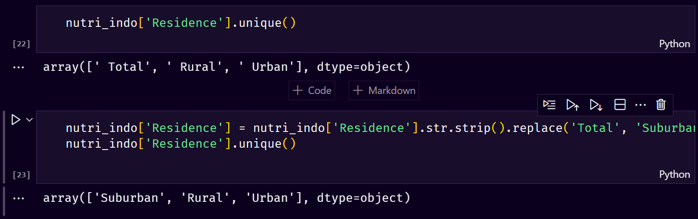
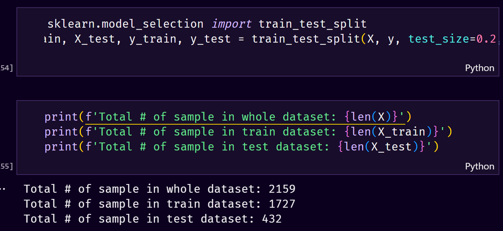

# Laporan Proyek Machine Learning - Tsaqif Mutashim Mufid

## Domain Proyek

- Stunting telah menjadi program nasional di Indonesia karena masih melibatkan sebagian besar penduduk. Upaya pencegahan stunting memerlukan pemahaman mendalam terhadap faktor-faktor yang menjadi determinan, baik dari pihak ibu maupun anak. Faktor ibu yang menjadi determinan stunting melibatkan pendidikan ibu, kesadaran dalam mengonsumsi tablet tambah darah, menjaga kualitas makanan, serta kemampuan dalam mencari informasi gizi baik dari sumber-sumber terpercaya. Selain itu, faktor anak yang juga determinan stunting melibatkan kurangnya asupan ASI dan MPASI, terutama ketika ibu mengalami kekurangan gizi. Dengan kondisi tersebut, tumbuh kembang anak menjadi terhambat, menyebabkan kejadian stunting.
- Alasan lain dipilih domain ini karena berdasarkan penelitian, Stunting masih menjadi masalah yang serius di Indonesia. Standard WHO terkait prevalensi stunting harus di angka kurang dari 20% tetapi Indonesia masih berada pada angka 21,6% di tahun 2022.
- Referensi Artikel:
  1. [Prevalensi Stunting di Indonesia Turun ke 21,6% dari 24,4%](https://sehatnegeriku.kemkes.go.id/baca/rilis-media/20230125/3142280/prevalensi-stunting-di-indonesia-turun-ke-216-dari-244/)
  2. [HUBUNGAN FAKTOR EKONOMI DAN POLA ASUH ORANG TUA DENGAN KEJADIAN STUNTING PADA BALITA DI DESA KEMBANG KERANG DAYA](https://www.ojs.cahayamandalika.com/index.php/jtm/article/view/2065/1631)
  3. [Edukasi Mengenai Pertumbuhan Ekonomi Keluarga Yang Efektif Dapat Menurunkan Angka Stunting Khususnya  Praktik Malnutrisi Pada Anak](https://jurnalpengabdianmasyarakatbangsa.com/index.php/jpmba/article/view/390/290)
  4. [Hubungan Pola Pemberian Makan Pada Balita Stunting di Puskesmas di Flores Timur](https://jurnal-eureka.com/index.php/inhealth/article/view/151/165)
  5. [ATASI STUNTING DENGAN BERHEMAT (BERIKAN MP-ASI SEHAT DAN TEPAT DI DESA AIKMEL BARAT](http://112.78.38.8/index.php/jce/article/view/17715/8363)
  6. [Hubungan Faktor Ibu Dan Anak Terhadap Kejadian Stunting Pada Balita](https://jmi.rivierapublishing.id/index.php/rp/article/view/304/519)

## Business Understanding

Hakikatnya kita sebagai anak muda memerlukan pengetahuan lebih faktor apa saja yang menyebabkan terjadinya stunting pada anak untuk bekal di kehidupan berikutnya. Anak muda zaman sekarang atau kita bisa sebut saja dia Gen-Z masih clueless tentang stunting, mungkin saja beberapa mulai sadar akan stunting dikarenakan sedang ramai dibicarakan di televisi. Hal ini mendorong penulis untuk membantu para calon bapak nanti untuk memperhatikan gizi pada buah hati yang meliputi faktor apa saja yang mempengaruhi anak menjadi stunting sehingga kita dapat menjadi lebih awarness terhadap faktor tersebut serta membantu target angka prevalensi menjadi turun 3,8% per tahunnya.

### Problem Statements

Berdasarkan permasalahan tersebut saya menjadi bertanya - tanya bahwa seringkali mendengar ketika ibu hamil makannya harus dijaga, makanannya harus bergizi, dan terkadang karena hal itu pula si ibu pun harus menurutinya. Nah dari situ saya coba merumuskan beberapa pertanyaan diantara lain:
- Apa saja faktor yang berpengaruh terhadap kasus stunting?
- Faktor mana saja yang menyebabkan kemungkinan tertinggi dalam kasus stunting?
- Apakah ada suatu cara untuk memprediksi dan mencegah stunting pada anak?

### Goals

Untuk menjawab dari permasalahan sebelumnya, saya mencoba membuat predictive analysis dengan tujuan atau goals sebagai berikut:
- Mengetahui faktor apa saja yang memiliki korelasi terhadap kasus stunting
- Mengetahui faktor yang memiliki korelasi paling tinggi terhadap kasus stunting 
- Membuat model machine learning yang dapat memprediksi apakah anak nantinya mengidap stunting dengan seakurat mungkin berdasarkan fitur - fitur yang ada 

## Data Understanding
Pada kasus ini saya mengarahkan langsung kepada dataset resmi keluaran dari UNICEF yang berisikan data - data yang beririsan dengan kasus stunting. [UNICEF](https://sdmx.data.unicef.org/databrowser/index.html?q=UNICEF:NUTRITION(1.0)).

Didalamnya banyak sekali variabel - variabel yang bisa dipakai namun saya hanya berfokus kedalam beberapa variabel dibawah ini untuk mengetahui scope batasan persebaran datanya.  

### Variabel-variabel pada UNICEF Nutrion dataset adalah sebagai berikut:
- 'REF_AREA:Geographic area' : Merupakan data geografis yang disajikan pada dataset dalam kasus ini area 'Indonesia' menjadi target.
- 'INDICATOR:Indicator' : Merupakan data yang mencakup sejumlah indikator yang beragam terkait dengan status gizi anak, mencakup aspek-aspek seperti pemberian ASI, pertumbuhan fisik, pola makan, dan cakupan suplementasi. Indikator ini melibatkan kategorisasi seperti tingkat stunting, wasting, overweight, serta informasi terkait dengan praktik pemberian makanan dan gizi sejak lahir.
- 'SEX:Sex' : Merupakan data yang mengidentifikasi jenis kelamin individu dan mencakup tiga kategori: 'Male', 'Female', dan 'Total'. Kategori 'Total' mungkin merujuk pada total keseluruhan populasi atau total dari suatu kelompok tertentu.
- 'AGE:Current age' : Merupaan data yang mencerminkan informasi tentang usia individu dalam dataset. Variabel ini dirancang untuk menggambarkan variasi usia di antara subjek data. Analisis terhadap variabel ini dapat memberikan wawasan tentang distribusi usia dalam dataset, memungkinkan identifikasi tren atau pola yang mungkin berkaitan dengan kelompok usia tertentu
- 'WEALTH_QUINTILE:Wealth Quintile' : Merupakan data yang mencakup informasi tentang klasifikasi kekayaan individu atau rumah tangga dalam dataset. Kelompok kekayaan ini dibagi menjadi beberapa kategori atau quintile, mencerminkan tingkat kekayaan yang berbeda.
- 'RESIDENCE:Residence' : Merupakan data yang mencakup informasi tentang lokasi tempat tinggal individu atau rumah tangga dalam dataset. Variabel ini mungkin menggambarkan beragam tipe tempat tinggal atau wilayah geografis tanpa merinci setiap kategori secara spesifik.
- 'MATERNAL_EDU_LVL:Mother\'s Education Level' : Merupakan data yang memuat informasi mengenai tingkat pendidikan ibu dari individu atau anak dalam dataset. Variabel ini mungkin mengelompokkan tingkat pendidikan menjadi beberapa kategori umum.
- 'TIME_PERIOD:Time period' : Merupakan data yang mencakup informasi tentang periode waktu yang terkait dengan data dalam dataset. Variabel ini mungkin mencerminkan rentang waktu atau tanggal pengumpulan data tanpa merinci periode waktu secara spesifik.
- 'OBS_VALUE:Observation Value' : Merupakan data yang memuat informasi tentang nilai observasi yang terkait dengan data dalam dataset. Variabel ini mungkin mencakup beragam nilai dari 0-100.

#### Data Wragling

Dikarenakan hasil dataset yang didapatkan berisikan data yang raw atau kotor. Kita harus mempersiapkan terlebih dahulu agar dataset yang akan kita pakai sudah bersih tahap ini adalah mengolah data yang kotor menjadi bersih.

- Sebelumnya kita akan memuat dataset yang sudah kita peroleh menggunakkan library pandas

- Setelah dimuat maka terlihat bahwa data yang diperoleh dari UNICEF masih berbentuk kondisi yang tidak kita inginkan, selanjutnya maka kita coba telusuri dengan menggunakan fungsi info().

- Dikarenakan banyaknya feature variabel maka sesuai dengan kondisi di atas, kita hanya akan menggunakan variabel tertentu agar scope yang kita telusuri sesuai dan tida melabar kemana - mana. Dalam penentuan variabel yang akan diekstraksi, saya menggunakan fungsi parameter dari pandas yaitu chunksize yang merupakan kondisi yang paling cocok dari kasus ini dikarenakan dataset kita yang cukup besar dan complex sehingga kita memerlukan potongan - potongan kecil untuk dalam pemrosesan.

- Setelah di define menggunakan chunk, selanjutnya kita akan mencoba mengambil variabel yang akan kita pakai sesuai dengan diatas.

- Tidak lupa juga karena penggambaran data seperti yang dilihat pada Data Loading sangat berantakan, maka disini saya juga mencoba untuk string manipulation agar terlihat agar rapih. Prosesnya seperti berikut ini

- Maka akan hasilnya seperti ini, terlihat bukan datanya lebih readable?

- Karena data setelah ekstraksi masih dalam bentuk string, sekarang kita rubah menjadi dataframe agar terlihat perbedaannya

- Setelah datanya mudah dibaca, sekarang saatnya kita memeriksa apakah dataset yang telah kita bersihkan memiliki nilai duplikat dengan menggunakan fungsi df.duplicated().sum(). Setelah itu melihat apakah data memiliki nilai null dengan fungsi isnull().

- Berikutnya, kita akan menelusuri lebih jauh terhadap variabel Indicator. Dikarenakan banyak juga feature yang akan diambil maka saya memutuskan untuk mengambil variabel berelevansi atas literatur yang telah dilampirkan pada data diatas. Selebihnya bisa cek pada notebook.

- Selanjutnya kita coba seleksi fitur variabel yang ada pada di Indicator.

- Setelah kita coba seleksi fitur, sekarang kita akan coba gabungkan beberapa tabel lainnya ke dalam dataframe baru.

- Berikutnya, mencari informasi tentang dataset mengenai jumlah baris data,kolom data terhadap DataFrame baru. Saya menggunakan fungsi shape().

- Selanjutnya kita coba manipulasi string kembali terhadap variabel - variabel diatas agar mudah dibaca.
Residence:

Education:

Poverty:

#### Exploratory Data Analysis and Vizualizations

Pada tahap ini saya mencoba mencari tahu apakah tedapat Outliers pada data yang setelah melakukan aksi yang diatas, serta mencari korelasi yang antar variable, dan juga melakukan coba analisis sederhana yang mencakup Univariate, Bivariate dan Multivariate. 

Sebelum masuk lebih jauh, kita akan mencoba untuk melihat persebaran datanya terlebih dahulu. Dari hasil yang bisa didapatkan bahwa data yang diperoleh pendistribusiannya tidak normal lebih mengarah Right-Skewed or Positive-Skewed. 

Dari gambar diatas didapati bahwa tidak adanya outliers yang menandakan bahwa data kita tidak masuk ke step khusus untuk menangani outliers. Dilakukan juga Univariate analysis terhadap feature yang ada lebih lengkapnya bisa di cek pada collab EDA

Selanjutnya setelah diketahui distribusi data tidak adanya outliers, maka kita bisa lanjutkan step berikutnya yaitu Bivariate analysis Indicator terhadap Maternal Education. Fokus utamanya terhadap kasus stunting.

Diketahui dari heatmap tersebut bahwa korelasi kasus stunting dipengaruhi oleh beberapa faktor diantaranya Underweight, Wasting, Severve_Wasting, Overweight. Selain itu pemberian ASI pada rentang waktu 12 - 15 Bulan ke bayi mempunyai pengaruh juga terhadap Stunting. Turut serta bepengaruh juga terhadap ASI yang diberikan oleh batita hal ini bisa dilihat pada indikator BMI_Age.

Dari grafik bar diatas juga bahwa Stunting sendiri terjadi di kalangan masyarakat yang tidak mempunyai latar belakang pendidikan yang bagus. Hal ini dikuatkan berdasarkan literatur yang terlampir bahwa seseorang yang memiliki pendidikan yang cukup baik telah diberikan sosialisasi dan pengetahuan mengenai tumbuh kembang anak.

Berikutnya, kita akan mencoba Bivariate analysis Indicator terhadap Poverty_Rating atau kekayaan. Pada analisis kali ini juga didapatkan data bahwa ternyata rata - rata yang mengalami Stunting berada pada masyarakat yang berekonomi rendah. Bisa dilihat pada gambar dibawah:

Dari situ bisa disimpulkan bahwa masyarakat yang berekonomi rendah berpengaruh juga kedalam kasus pendidikan juga Stunting.

## Data Preparation
Sebelum kita masuk ke dalam modeling tentunya ada yang harus dilakukan terlebih dahulu yaitu mengkonversi data yang kita punya kedalam numeric. Tujuannya adalah agar mesin dapat mengenali mengenai data kita, pada laporan proyek ini dibuat saya membuat persebaran data train sebesar 80% dan 20% sebagai data test.

Berikutnya, step yang akan dilakukan adalah melabeli data yang kita punya dengan library bawaan dari sckit-learn yaitu LabelEncoder. LabelEncoder dipilih dikarenakan banyaknya data yang bersifat categorical sehingga akan memudahkan dalam pre-procesing data dalam sekali jalan.

Pada gambar diatas, feature column data yang telah di pre-processing antara lain Maternal_Education, Indicator, dan sebagainya yang bisa dilihat pada notebook.

Setelah dilakukan pelabelan, selanjutnya kita akan masuk ke dalam Feature Selection. Feature selection dilakukan agar model dari yang kita bangun berasal dari data yang paling penting yang harus ada.

Pada data diatas terlihat bahwa, variabel 'Indicator', 'Gender', 'Maternal_Education' memiliki fitur yang penting untuk permodelan. Oleh karena itu, maka feature selection yang dipilih adalah semua hal yang berkaitan dengan 'Indicator'.

Selepas telah mengetahui fitur mana yang penting untuk di masukkan, sekarang saatnya menyiapkan data untuk digunakan terhadap model yang akan dibuat seperti yang telah saya bicarakan diatas bahwa data yang saya siapkan meliputi 80% data train dan 20% data test.

## Modeling
Modeling merupakan tahap yang akan menentukan apakah pembelajaran mesin ini dapat memberikan hasil prediksi yang baik. Dalam kasus Stunting ini saya menggunakan 5 Algoritma, yaitu:
1. Linear Regression
   
2. Decision Tree Regression
   
3. Random Forest Regression
   
4. Support Vector Regression
   
5. Gradient Boosting Regression
   

## Evaluation
Setelah model dilakukan pelatihan, adapun metrik evaluasi yang akan saya gunakan pada kasus Stunting ini adalah MAE, MSE. Serta ada tambahan aksi yaitu menentukan r2_score agar kita bisa lebih dapat memahami berapa ukuran sebuah metrik akurasi. Berikut hasil MAE, MSE kelima model yang sudah di evaluasi:

Dari gambar diatas dapat disimpulkan bahwa kandidat terkuat dimiliki oleh algoritma Random Forest Regression and Gradient Boosting Regression. Indikator dikatakan model yang dihasilkan merupakan pilihan terbaik dikarenakan MAE serta MSE nya paling kecil diantara lainnya dikatakan jika MAE serta MSE didapati valuenya kecil maka bisa dikatakan model yang mempunyai performa yang bagus. Selanjutnya untuk penambahan aksi yang biasanya bertemu dengan metrik akurasi, disini saya menggunakan r2_score agar bisa mendapatkan nilai yang bisa dipahami oleh beberapa mayoritas, berikut hasil setelah dilakukannya r2_score:

Hasil yang didapati mulai terlihat bahwa model terbaik dimiliki oleh algoritma Random Forest Regression and Gradient Boosting Regression karena nilai yang dihasilkan cukup identik. Namun jika bener - bener ditentukan mana yang terbaik yaitu Gradient Boosting Regression.
Berikutnya, kita akan mencoba visualisasi hasil dari evaluasi yang kita lakukan agar semuanya terjasi dalam bentuk informasi.

Sekian laporan yang bisa saya sajikan, dari keseluruhan proses yang dilakukan pertanyaan yang dilontarkan pada problem statement telah terjawab.
