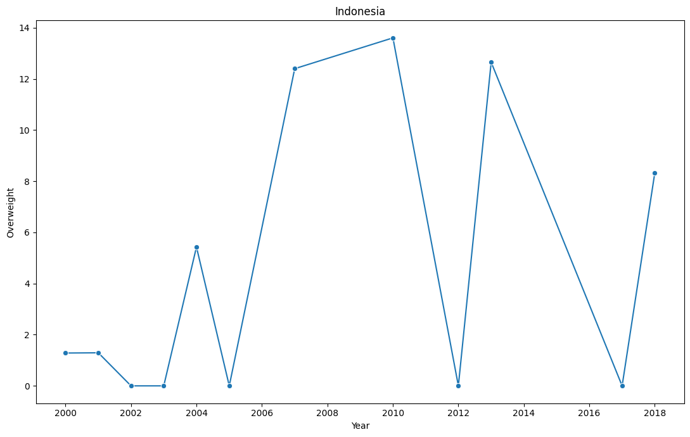
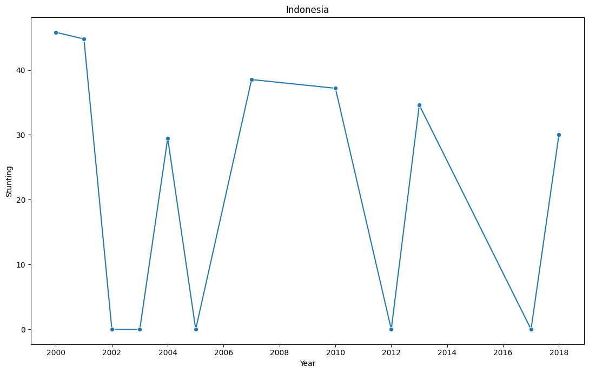

# Laporan Proyek Machine Learning - Tsaqif Mutashim Mufid

## Domain Proyek

*Stunting* telah menjadi program nasional di Indonesia karena masih melibatkan sebagian besar penduduk. Upaya pencegahan *stunting* memerlukan pemahaman mendalam terhadap faktor-faktor yang menjadi determinan, baik dari pihak ibu maupun anak. Faktor ibu yang menjadi determinan *stunting* melibatkan pendidikan ibu, kesadaran dalam mengonsumsi tablet tambah darah, menjaga kualitas makanan, serta kemampuan dalam mencari informasi gizi baik dari sumber-sumber terpercaya [1]. Selain itu, faktor anak yang juga determinan *stunting* melibatkan kurangnya asupan ASI dan MPASI, terutama ketika ibu mengalami kekurangan gizi. Dengan kondisi tersebut, tumbuh kembang anak menjadi terhambat, menyebabkan kejadian *stunting* [2]. *Stunting* merupakan masalah gizi utama di negara-negara berkembang, termasuk Indonesia. *Stunting* dapat terjadi pada anak setelah usia 6 bulan, dan semua anak membutuhkan makanan lunak yang bergizi, umumnya dikenal sebagai makanan pendamping ASI (MP-ASI), selain ASI. Ada berbagai faktor yang dapat menyebabkan *stunting*, seperti kurangnya pemberian ASI eksklusif, rendahnya kadar kalsium dalam ASI, dan gumoh yang berlebihan setelah menyusui. *Stunting* merupakan kondisi gagal tumbuh pada anak balita akibat kekurangan gizi kronis terutama dalam 1.000 hari pertama kehidupan sehingga anak terlalu pendek untuk usianya [3]. Penelitian telah menunjukkan bahwa pemberian ASI eksklusif secara signifikan berhubungan dengan risiko stunting yang lebih rendah [4] [2]. Dalam upaya menurunkan angka *stunting*, khususnya praktik malnutrisi pada anak telah banyak dilakukan seminar yang bertujuan untuk mendiskusikan peran penting pertumbuhan ekonomi keluarga [5]. Faktor ekonomi merupakan jumlah pendapatan yang diperoleh keluarga untuk memenuhi keperluan rumah tangga [3]. Selain itu, *stunting* masih menjadi masalah yang serius di Indonesia, dengan prevalensi *stunting* pada tahun 2022 sebesar 21,6% [6]. Hal ini berbeda dengan target WHO, yang harus di bawah 20% [7]. Oleh karena itu, pemanfaatan pembelajaran mesin diharapkan dapat membantu memprediksi dan mencegah malnutrisi pada anak.

**References**:
> [1]	I. R. Putri and M. Anas, “Hubungan Faktor Ibu Dan Anak Terhadap Kejadian Stunting Pada Balita,” J. Multidisiplin Indones., vol. 2, no. 7, pp. 1450–1469, Jul. 2023, doi: 10.58344/jmi.v2i7.304.

> [2]	A. K. S. Lebuan, M. Syafar, and N. Hartati, “Hubungan Pola Pemberian Makan Pada Balita Stunting di Puskesmas di Flores Timur”.

> [3]	E. M. Yanti, “HUBUNGAN FAKTOR EKONOMI DAN POLA ASUH ORANG TUA DENGANKEJADIAN STUNTING PADA BALITA DI DESA KEMBANG KERANG DAYA,” vol. 4, no. 8, 2023.

> [4]	R. S. Putra Pratama, M. S. Dasuki, T. Agustina, and S. Soekiswati, “ASI Eksklusif Sebagai Faktor Protektif Terhadap Kejadian Stunting Pada Balita 24-59 Bulan,” J. Ilm. Kesehat. Sandi Husada, vol. 11, no. 1, pp. 262–270, Jun. 2022, doi: 10.35816/jiskh.v11i1.748.

> [5]	E. Endraria and P. Susilo, “Edukasi Mengenai Pertumbuhan Ekonomi Keluarga Yang Efektif Dapat Menurunkan Angka Stunting Khususnya Praktik Malnutrisi Pada Anak,” J. Pengabdi. Masy. Bangsa, vol. 1, no. 8, pp. 1580–1588, Oct. 2023, doi: 10.59837/jpmba.v1i8.390.

> [6]	H. T. Sinaga, N. Achmad, M. Manalu, S. Perangin-Angin, and L. G. Doloksaribu, “Length Attainment and Stunting Prevalence of Children aged 0–24 Months Living in the Area of Clay Brick Kilns in Pagar Merbau Sub District, Indonesia,” Open Access Maced. J. Med. Sci., vol. 10, no. E, pp. 155–160, Jan. 2022, doi: 10.3889/oamjms.2022.7969.

> [7]	A. J. Pitoyo, A. Saputri, R. E. Agustina, and T. Handayani, “Analysis of Determinan of Stunting Prevalence among Stunted Toddlers in Indonesia,” Populasi, vol. 30, no. 1, p. 36, Jun. 2022, doi: 10.22146/jp.75796.

## Business Understanding

Hakikatnya, generasi muda membutuhkan pemahaman mendalam mengenai faktor-faktor yang dapat menyebabkan *stunting* pada anak sebagai bekal penting dalam menghadapi kehidupan mendatang. Generasi Z, sering disebut sebagai anak-anak muda, masih memiliki pengetahuan terbatas mengenai *stunting*. Beberapa mulai menyadari masalah ini karena menjadi perbincangan umum di televisi. Hal ini menjadi motivasi bagi penulis untuk membantu calon orang tua agar lebih memperhatikan aspek gizi anak-anak mereka, termasuk pemahaman tentang faktor-faktor yang dapat memicu *stunting*.

Harapannya dengan adanya pemahaman faktor - faktor tersebut dapat meningkatkan kesejahteraan masyarakat secara menyeluruh dan dapat mengurangi angka kasus *stunting* di kalanagan anak - anak. Hal ini akan memberikan dampak positif pada generasi masa depan untuk meningkatkan kualitas hidup dan membentuk masyarakat yang lebih sehat secara keseluruhan. Selain itu juga, mengurangi tingkat *stunting* dapat berkontribusi pada penurunan beban kesehatan masyarakat dan peningkatan produktivitas di masa mendatang. 

Pemanfaatan teknologi pembelajaran mesin menjadi bagian penting dari solusi ini. Dengan menerapkan teknologi ini, kita dapat menganalisis data yang kompleks terkait stunting pada anak. Pembelajaran mesin membantu dalam memprediksi risiko stunting dan menciptakan sistem yang mendukung orang tua serta tenaga kesehatan. Semua ini diharapkan tidak hanya meningkatkan pemahaman, tetapi juga membantu mengurangi kasus *stunting* sebesar 3,8% setiap tahunnya.

### Problem Statements

Dengan latar belakang permasalahan yang diungkapkan, muncul pertanyaan-pertanyaan yang relevan terkait aspek penting dalam perawatan kehamilan, terutama berkaitan dengan pengaturan pola makan ibu hamil untuk memastikan asupan gizi yang optimal. Beberapa pertanyaan yang diajukan untuk merumuskan pemahaman lebih mendalam melibatkan:
> **Bagaimana hubungan antara pola makan seorang ibu hamil dan risiko stunting pada anak yang dikandungnya?**

> **Apakah ada korelasi antara faktor-faktor terkait gizi dalam makanan ibu hamil dan kemungkinan terjadinya stunting pada anak?**

> **Adakah metode atau langkah-langkah yang dapat diambil untuk memastikan pemenuhan gizi yang optimal selama kehamilan, dengan tujuan mencegah kasus stunting pada anak yang dilahirkan?**

### Goals

Untuk menjawab dari permasalahan sebelumnya, penulis mencoba membuat predictive analysis dengan tujuan atau goals sebagai berikut:
> **Mengidentifikasi dan menganalisis hubungan antara pola makan ibu hamil dengan risiko stunting pada anak yang sedang dikandungnya**

> **Mengetahui korelasi antara faktor-faktor gizi dalam makanan ibu hamil dan potensi terjadinya stunting pada anak yang dilahirkan.**

> **Membuat model predictive analysis yang dapat memprediksi tingkat risiko stunting pada anak berdasarkan faktor-faktor gizi dalam makanan ibu hamil, dengan tingkat akurasi yang tinggi.**

## Data Understanding
Pada kasus ini penelitian difokuskan pada dataset resmi UNICEF yang berisi data terkait kasus stunting. Dataset ini dapat diakses melalui [UNICEF](https://sdmx.data.unicef.org/databrowser/index.html?q=UNICEF:NUTRITION(1.0)).

Walaupun dataset tersebut mencakup berbagai variabel, penelitian ini memusatkan fokus pada beberapa variabel tertentu untuk mengidentifikasi batasan dan distribusi data yang relevan. Karena dataset bersifat mentah atau belum terstruktur, langkah awal yang harus diambil adalah melakukan pembersihan data. Proses ini melibatkan tahapan mengolah data yang kotor menjadi data yang bersih.

Sebelumnya kita akan memuat dataset yang sudah kita peroleh menggunakkan library pandas.
```sh
import pandas as pd
data = pd.read_csv('Nutritions.csv')
data.head()
```
Hasil dari pemrosesan code diatas dapat dilihat pada Tabel 1
| DATAFLOW | REF_AREA:Geographic area         | INDICATOR:Indicator | SEX:Sex                                           | AGE:Current age | WEALTH_QUINTILE:Wealth Quintile | RESIDENCE:Residence | MATERNAL_EDU_LVL:Mother's Education Level | HEAD_OF_HOUSE:Head of House | TIME_PERIOD:Time period | ...  | OBS_STATUS:Observation Status | OBS_CONF:Observation confidentaility | LOWER_BOUND:Lower Bound | UPPER_BOUND:Upper Bound | STD_ERR:Standard Error | WGTD_SAMPL_SIZE:Weighted Sample Size | TIME_PERIOD_METHOD:Time period activity related to when the data are collected | COVERAGE_TIME:The period of time for which data are provided | FREQ_COLL:Time interval at which the source data are collected | OBS_FOOTNOTE:Observation footnote |     |
| -------- | -------------------------------- | ------------------- | ------------------------------------------------- | --------------- | ------------------------------- | ------------------- | ----------------------------------------- | --------------------------- | ----------------------- | ---- | ----------------------------- | ------------------------------------ | ----------------------- | ----------------------- | ---------------------- | ------------------------------------ | ------------------------------------------------------------------------------ | ------------------------------------------------------------ | -------------------------------------------------------------- | --------------------------------- | --- |
| 0        | UNICEF:NUTRITION(1.0): Nutrition | IDN: Indonesia      | NT_BF_CBF_12_15: Continued breastfeeding (12-1... | F: Female       | M12T15: 12 to 15 months old     | _T: Total           | _T: Total                                 | _T: Total                   | _T: Total               | 2003 | ...                           | RA: Reanalysed                       | F: Free                 | 79.500000               | 90.199997              | 2.7                                  | 498.5                                                                          | MOF: Middle of fieldwork                                     | 1987-2017                                                      | 0: Not Known                      | NaN |
| 1        | UNICEF:NUTRITION(1.0): Nutrition | IDN: Indonesia      | NT_BF_CBF_12_15: Continued breastfeeding (12-1... | F: Female       | M12T15: 12 to 15 months old     | _T: Total           | _T: Total                                 | _T: Total                   | _T: Total               | 2007 | ...                           | RA: Reanalysed                       | F: Free                 | 76.199997               | 84.900002              | 2.2                                  | 531.6                                                                          | MOF: Middle of fieldwork                                     | 1987-2017                                                      | 0: Not Known                      | NaN |
| 2        | UNICEF:NUTRITION(1.0): Nutrition | IDN: Indonesia      | NT_BF_CBF_12_15: Continued breastfeeding (12-1... | F: Female       | M12T15: 12 to 15 months old     | _T: Total           | _T: Total                                 | _T: Total                   | _T: Total               | 2012 | ...                           | RA: Reanalysed                       | F: Free                 | 73.500000               | 83.199997              | 2.5                                  | 541.5                                                                          | MOF: Middle of fieldwork                                     | 1987-2017                                                      | 0: Not Known                      | NaN |
| 3        | UNICEF:NUTRITION(1.0): Nutrition | IDN: Indonesia      | NT_BF_CBF_12_15: Continued breastfeeding (12-1... | F: Female       | M12T15: 12 to 15 months old     | _T: Total           | _T: Total                                 | _T: Total                   | _T: Total               | 2017 | ...                           | RA: Reanalysed                       | F: Free                 | 75.000000               | 83.000000              | 2.0                                  | 588.4                                                                          | MOF: Middle of fieldwork                                     | 1987-2017                                                      | 0: Not Known                      | NaN |
| 4        | UNICEF:NUTRITION(1.0): Nutrition | IDN: Indonesia      | NT_BF_CBF_12_15: Continued breastfeeding (12-1... | M: Male         | M12T15: 12 to 15 months old     | _T: Total           | _T: Total                                 | _T: Total                   | _T: Total               | 2003 | ...                           | RA: Reanalysed                       | F: Free                 | 78.400002               | 87.699997              | 2.3                                  | 522.6                                                                          | MOF: Middle of fieldwork                                     | 1987-2017                                                      | 0: Not Known                      | NaN |
| ...      | ...                              | ...                 | ...                                               | ...             | ...                             | ...                 | ...                                       | ...                         | ...                     | ...  | ...                           | ...                                  | ...                     | ...                     | ...                    | ...                                  | ...                                                                            | ...                                                          | ...                                                            | ...                               | ... |
| 10955    | UNICEF:NUTRITION(1.0): Nutrition | IDN: Indonesia      | NT_VAS_TWODOSE: Vitamin A Supplementation, two... | _T: Total       | M6T59: 6 to 59 months old       | _T: Total           | _T: Total                                 | _T: Total                   | _T: Total               | 2012 | ...                           | AD: Adjusted                         | F: Free                 | NaN                     | NaN                    | NaN                                  | NaN                                                                            | OTHER: Other                                                 | 2000-2017                                                      | 0: Not Known                      | NaN |
| 10956    | UNICEF:NUTRITION(1.0): Nutrition | IDN: Indonesia      | NT_VAS_TWODOSE: Vitamin A Supplementation, two... | _T: Total       | M6T59: 6 to 59 months old       | _T: Total           | _T: Total                                 | _T: Total                   | _T: Total               | 2013 | ...                           | AD: Adjusted                         | F: Free                 | NaN                     | NaN                    | NaN                                  | NaN                                                                            | OTHER: Other                                                 | 2000-2017                                                      | 0: Not Known                      | NaN |
| 10957    | UNICEF:NUTRITION(1.0): Nutrition | IDN: Indonesia      | NT_VAS_TWODOSE: Vitamin A Supplementation, two... | _T: Total       | M6T59: 6 to 59 months old       | _T: Total           | _T: Total                                 | _T: Total                   | _T: Total               | 2014 | ...                           | AD: Adjusted                         | F: Free                 | NaN                     | NaN                    | NaN                                  | NaN                                                                            | OTHER: Other                                                 | 2000-2017                                                      | 0: Not Known                      | NaN |
| 10958    | UNICEF:NUTRITION(1.0): Nutrition | IDN: Indonesia      | NT_VAS_TWODOSE: Vitamin A Supplementation, two... | _T: Total       | M6T59: 6 to 59 months old       | _T: Total           | _T: Total                                 | _T: Total                   | _T: Total               | 2015 | ...                           | AD: Adjusted                         | F: Free                 | NaN                     | NaN                    | NaN                                  | NaN                                                                            | OTHER: Other                                                 | 2000-2017                                                      | 0: Not Known                      | NaN |
| 10959    | UNICEF:NUTRITION(1.0): Nutrition | IDN: Indonesia      | NT_VAS_TWODOSE: Vitamin A Supplementation, two... | _T: Total       | M6T59: 6 to 59 months old       | _T: Total           | _T: Total                                 | _T: Total                   | _T: Total               | 2017 | ...                           | AD: Adjusted                         | F: Free                 | NaN                     | NaN                    | NaN                                  | NaN                                                                            | OTHER: Other                                                 | 2000-2017                                                      | 0: Not Known                      | NaN |
Tabel 1. Data Loading

Pada Tabel 1 disajikan data yang berisikan dataset asli sebelum dilakukan tahap pengolahan data. Setelah dimuat, terlihat bahwa data dari UNICEF masih dalam kondisi yang perlu diperbaiki. Selanjutnya, akan dilakukan penelusuran kondisi data menggunakan fungsi info().
```sh
data.info()
```
| <class 'pandas.core.frame.DataFrame'>                                                                       |
| ----------------------------------------------------------------------------------------------------------- |
| RangeIndex: 10960 entries, 0 to 10959                                                                       |
| Data columns (total 30 columns):                                                                            |
| #   Column                                                                          Non-Null Count  Dtype   |
| ---  ------                                                                          --------------  -----  |
| 0   DATAFLOW                                                                        10960 non-null  object  |
| 1   REF_AREA:Geographic area                                                        10960 non-null  object  |
| 2   INDICATOR:Indicator                                                             10960 non-null  object  |
| 3   SEX:Sex                                                                         10960 non-null  object  |
| 4   AGE:Current age                                                                 10960 non-null  object  |
| 5   WEALTH_QUINTILE:Wealth Quintile                                                 10960 non-null  object  |
| 6   RESIDENCE:Residence                                                             10960 non-null  object  |
| 7   MATERNAL_EDU_LVL:Mother's Education Level                                       10960 non-null  object  |
| 8   HEAD_OF_HOUSE:Head of House                                                     10960 non-null  object  |
| 9   TIME_PERIOD:Time period                                                         10960 non-null  int64   |
| 10  OBS_VALUE:Observation Value                                                     10960 non-null  float64 |
| 11  REPORTING_LVL:Reporting level                                                   8941 non-null   object  |
| 12  INDICATOR_METADATA:Indicator metadata                                           10958 non-null  object  |
| 13  UNIT_MULTIPLIER:Unit multiplier                                                 10958 non-null  object  |
| 14  UNIT_MEASURE:Unit of measure                                                    10960 non-null  object  |
| 15  SOURCE_LINK:Citation of or link to the data source                              10958 non-null  object  |
| 16  SERIES_FOOTNOTE:Series footnote                                                 10958 non-null  object  |
| 17  CUSTODIAN:Custodian                                                             10958 non-null  object  |
| 18  PUBLICATION_DATE:Date of Publication                                            0 non-null      float64 |
| 19  DATA_SOURCE:Data Source                                                         10958 non-null  object  |
| 20  OBS_STATUS:Observation Status                                                   10856 non-null  object  |
| 21  OBS_CONF:Observation confidentaility                                            10958 non-null  object  |
| 22  LOWER_BOUND:Lower Bound                                                         8511 non-null   float64 |
| 23  UPPER_BOUND:Upper Bound                                                         8514 non-null   float64 |
| 24  STD_ERR:Standard Error                                                          7979 non-null   float64 |
| 25  WGTD_SAMPL_SIZE:Weighted Sample Size                                            9777 non-null   float64 |
| 26  TIME_PERIOD_METHOD:Time period activity related to when the data are collected  10937 non-null  object  |
| 27  COVERAGE_TIME:The period of time for which data are provided                    10876 non-null  object  |
| 28  FREQ_COLL:Time interval at which the source data are collected                  10936 non-null  object  |
| 29  OBS_FOOTNOTE:Observation footnote                                               48 non-null     object  |
| dtypes: float64(6), int64(1), object(23)                                                                    |
| memory usage: 2.5+ MB                                                                                       |
Tabel 2. Data Information

Berdasarkan Tabel 2, disajikan sumber informasi data yang mencakup jumlah kolom, tipe data, dan besaran data pada setiap kolomnya.

Dengan banyaknya variabel fitur, hanya akan dipilih beberapa variabel tertentu agar cakupan yang ditelusuri sesuai dan tidak terlalu meluas. Dalam menentukan variabel yang akan diekstraksi, akan menggunakan parameter fungsi dari pandas, yaitu *chunksize*. Sesuai dengan kondisi kasus ini, di mana dataset cukup besar dan kompleks, langkah ini perlu dilakukan untuk memproses data secara bertahap, sehingga memastikan hasilnya tidak memakan waktu yang terlalu lama. Variabel fitur yang akan diekstraksi akan dilakukan manipulasi string agar data lebih mudah dibaca, meliputi :


| Feature Selection                         | Result             | Data Understanding                                                                                                                                                                                                                                                                                                                                                       |
| ----------------------------------------- | ------------------ | ------------------------------------------------------------------------------------------------------------------------------------------------------------------------------------------------------------------------------------------------------------------------------------------------------------------------------------------------------------------------ |
| REF_AREA:Geographic area                  | Country            | `Merupakan data geografis yang disajikan pada dataset dalam kasus ini area 'Indonesia' menjadi target.`                                                                                                                                                                                                                                                                  |
| INDICATOR:Indicator                       | Indicator          | `Merupakan data yang mencakup sejumlah indikator yang beragam terkait dengan status gizi anak, mencakup aspek-aspek seperti pemberian ASI, pertumbuhan fisik, pola makan, dan cakupan suplementasi. Indikator ini melibatkan kategorisasi seperti tingkat stunting, wasting, overweight, serta informasi terkait dengan praktik pemberian makanan dan gizi sejak lahir.` |
| SEX:Sex                                   | Gender             | `Merupakan data yang mengidentifikasi jenis kelamin individu dan mencakup tiga kategori: 'Male', 'Female', dan 'Total'. Kategori 'Total' mungkin merujuk pada total keseluruhan populasi atau total dari suatu kelompok tertentu.`                                                                                                                                       |
| AGE:Current age                           | Age                | `Merupakan data yang mencerminkan informasi tentang usia individu dalam dataset. Variabel ini dirancang untuk menggambarkan variasi usia di antara subjek data. Analisis terhadap variabel ini dapat memberikan wawasan tentang distribusi usia dalam dataset, memungkinkan identifikasi tren atau pola yang mungkin berkaitan dengan kelompok usia tertentu`            |
| WEALTH_QUINTILE:Wealth Quintile           | Poverty_Rating     | `Merupakan data yang mencakup informasi tentang klasifikasi kekayaan individu atau rumah tangga dalam dataset. Kelompok kekayaan ini dibagi menjadi beberapa kategori atau quintile, mencerminkan tingkat kekayaan yang berbeda.`                                                                                                                                        |
| RESIDENCE:Residence                       | Residence          | `Merupakan data yang mencakup informasi tentang lokasi tempat tinggal individu atau rumah tangga dalam dataset. Variabel ini mungkin menggambarkan beragam tipe tempat tinggal atau wilayah geografis tanpa merinci setiap kategori secara spesifik.`                                                                                                                    |
| MATERNAL_EDU_LVL:Mother's Education Level | Maternal_Education | `Merupakan data yang memuat informasi mengenai tingkat pendidikan ibu dari individu atau anak dalam dataset. Variabel ini mungkin mengelompokkan tingkat pendidikan menjadi beberapa kategori umum.`                                                                                                                                                                     |
| TIME_PERIOD:Time period                   | Year               | `Merupakan data yang mencakup informasi tentang periode waktu yang terkait dengan data dalam dataset. Variabel ini mungkin mencerminkan rentang waktu atau tanggal pengumpulan data tanpa merinci periode waktu secara spesifik.`                                                                                                                                        |
| OBS_VALUE:Observation Value               | Observation_Value  | `Merupakan data yang memuat informasi tentang nilai observasi yang terkait dengan data dalam dataset. Variabel ini mungkin mencakup beragam nilai dari 0-100.`                                                                                                                                                                                                           |
Tabel 3. Tabel Feature Selection


| [          Country                                      Indicator   Gender  \ |
| ----------------------------------------------------------------------------- |
| 0       Indonesia         Continued breastfeeding (12-15 months)   Female     |
| 1       Indonesia         Continued breastfeeding (12-15 months)   Female     |
| 2       Indonesia         Continued breastfeeding (12-15 months)   Female     |
| 3       Indonesia         Continued breastfeeding (12-15 months)   Female     |
| 4       Indonesia         Continued breastfeeding (12-15 months)     Male     |
| ...           ...                                            ...      ...     |
| 10955   Indonesia   Vitamin A Supplementation, two-dose coverage    Total     |
| 10956   Indonesia   Vitamin A Supplementation, two-dose coverage    Total     |
| 10957   Indonesia   Vitamin A Supplementation, two-dose coverage    Total     |
| 10958   Indonesia   Vitamin A Supplementation, two-dose coverage    Total     |
| 10959   Indonesia   Vitamin A Supplementation, two-dose coverage    Total     |
|                                                                               |
| Age Poverty_Rating Residence Maternal_Education  Year  \                      |
| 0       12 to 15 months old          Total     Total              Total  2003 |
| 1       12 to 15 months old          Total     Total              Total  2007 |
| 2       12 to 15 months old          Total     Total              Total  2012 |
| 3       12 to 15 months old          Total     Total              Total  2017 |
| 4       12 to 15 months old          Total     Total              Total  2003 |
| ...                     ...            ...       ...                ...   ... |
| 10955    6 to 59 months old          Total     Total              Total  2012 |
| 10956    6 to 59 months old          Total     Total              Total  2013 |
| 10957    6 to 59 months old          Total     Total              Total  2014 |
| 10958    6 to 59 months old          Total     Total              Total  2015 |
| 10959    6 to 59 months old          Total     Total              Total  2017 |
|                                                                               |
| Observation_Value                                                             |
| 0                   85.7                                                      |
| 1                   80.9                                                      |
| 2                   78.7                                                      |
| 3                   79.3                                                      |
| 4                   83.6                                                      |
| ...                  ...                                                      |
| 10955               73.0                                                      |
| 10956               82.0                                                      |
| 10957               84.0                                                      |
| 10958               82.0                                                      |
| 10959               62.0                                                      |
|                                                                               |
| [10960 rows x 9 columns]]                                                     |
Tabel 2. String Variable Feature

Pada Tabel 2, data masih berjenis string, sehingga data tersebut belum dapat diolah lebih lanjut. Oleh karena itu, setelah dilakukan manipulasi string pada variabel fitur, langkah berikutnya adalah mencoba mengonversi data ke dalam bentuk dataframe agar memungkinkan pemrosesan lebih lanjut. Berikut hasil konversi kedalam bentuk dataframe bisa dilihat pada Tabel 3.
| Country   | Indicator                              | Gender | Age                 | Poverty_Rating | Residence | Maternal_Education | Year | Observation_Value |
| --------- | -------------------------------------- | ------ | ------------------- | -------------- | --------- | ------------------ | ---- | ----------------- |
| Indonesia | Continued breastfeeding (12-15 months) | Female | 12 to 15 months old | Total          | Total     | Total              | 2003 | 85.7              |
| Indonesia | Continued breastfeeding (12-15 months) | Female | 12 to 15 months old | Total          | Total     | Total              | 2007 | 80.9              |
| Indonesia | Continued breastfeeding (12-15 months) | Female | 12 to 15 months old | Total          | Total     | Total              | 2012 | 78.7              |
| Indonesia | Continued breastfeeding (12-15 months) | Female | 12 to 15 months old | Total          | Total     | Total              | 2017 | 79.3              |
| Indonesia | Continued breastfeeding (12-15 months) | Male   | 12 to 15 months old | Total          | Total     | Total              | 2003 | 83.6              |
| Indonesia | Continued breastfeeding (12-15 months) | Male   | 12 to 15 months old | Total          | Total     | Total              | 2007 | 78.9              |
| Indonesia | Continued breastfeeding (12-15 months) | Male   | 12 to 15 months old | Total          | Total     | Total              | 2012 | 75.8              |
| Indonesia | Continued breastfeeding (12-15 months) | Male   | 12 to 15 months old | Total          | Total     | Total              | 2017 | 73.7              |
| Indonesia | Continued breastfeeding (12-15 months) | Total  | 12 to 13 months old | Total          | Total     | Total              | 2003 | 88.4              |
| Indonesia | Continued breastfeeding (12-15 months) | Total  | 12 to 13 months old | Total          | Total     | Total              | 2007 | 82.0              |
Tabel 3. Dataframe Dataset

Sebelumnya, tipe data pada variabel fitur 'Year' masih dalam bentuk 'integer'. Proses konversi tipe data dilakukan menjadi 'datetime' dengan menggunakan fungsi `pd.to_datetime(df['Year'], format='%Y')`. Hal ini bertujuan untuk memungkinkan analisis tren kondisi yang sedang terjadi, perubahan tersebut menggunakan fungsi `df.info()` yang dapat dilihat pada Tabel 4.
| <class 'pandas.core.frame.DataFrame'>                  |
| ------------------------------------------------------ |
| RangeIndex: 10960 entries, 0 to 10959                  |
| Data columns (total 9 columns):                        |
| #   Column              Non-Null Count  Dtype          |
| ---  ------              --------------  -----         |
| 0   Country             10960 non-null  object         |
| 1   Indicator           10960 non-null  object         |
| 2   Gender              10960 non-null  object         |
| 3   Age                 10960 non-null  object         |
| 4   Poverty_Rating      10960 non-null  object         |
| 5   Residence           10960 non-null  object         |
| 6   Maternal_Education  10960 non-null  object         |
| 7   Year                10960 non-null  datetime64[ns] |
| 8   Observation_Value   10960 non-null  float64        |
| dtypes: datetime64[ns](1), float64(1), object(7)       |
| memory usage: 770.8+ KB                                |
Tabel 4. Informasi Data

Pada Tabel 4, disajikan sebuah informasi variabel fitur, tipe data, dan jumlah data sebesar 10959.

Setelah data menjadi lebih mudah dibaca, langkah selanjutnya adalah memeriksa apakah dataset yang telah dibersihkan memiliki nilai duplikat dengan menggunakan fungsi `df.duplicated().sum()`. Pada tahap ini, juga dilakukan evaluasi terhadap keberadaan nilai null dalam data menggunakan fungsi `df.isnull()` seperti pada Gambar 6

Gambar 1. Data Null dan Duplicated

Seperti yang terlihat pada Gambar 1, data yang telah melalui tahap pemrosesan tidak menunjukkan adanya nilai *null* maupun *duplicated*.

Selanjutnya, akan dilakukan penelusuran lebih lanjut terhadap variabel "Indicator". Pemilihan variabel ini didasarkan pada relevansinya dengan literatur yang telah dilampirkan pada data di atas diataranya:
- Ever breastfed (0-23 months)
- Continued breastfeeding (12-15 months)
- Continued breastfeeding (12-23 months)
- Continued breastfeeding (20-23 months)
- Introduction to solid, semi-solid foods (6-8 months)
- Minimum meal frequency (children aged 6 to 23 months)
- Mean BMI-for-age
- Height-for-age <-2 SD (stunting)
- Weight-for-age <-2 SD (Underweight)
- Weight-for-height <-2 SD (wasting)
- Weight-for-height <-3 SD (severe wasting)
- Weight-for-height >+2 SD (overweight)
- Vitamin A Supplementation, two-dose coverage
- Prevalence of low birth weight among new-borns

Hasil seleksi fitur variabel yang terdapat pada kolom "Indicator" terlihat pada Gambar 5.
|       | Country   | Indicator                              | Gender | Age                 | Poverty_Rating | Residence | Maternal_Education | Year       | Observation_Value |
| ----- | --------- | -------------------------------------- | ------ | ------------------- | -------------- | --------- | ------------------ | ---------- | ----------------- |
| 0     | Indonesia | Continued breastfeeding (12-15 months) | Female | 12 to 15 months old | Total          | Total     | Total              | 2003-01-01 | 85.7              |
| 1     | Indonesia | Continued breastfeeding (12-15 months) | Female | 12 to 15 months old | Total          | Total     | Total              | 2007-01-01 | 80.9              |
| 2     | Indonesia | Continued breastfeeding (12-15 months) | Female | 12 to 15 months old | Total          | Total     | Total              | 2012-01-01 | 78.7              |
| 3     | Indonesia | Continued breastfeeding (12-15 months) | Female | 12 to 15 months old | Total          | Total     | Total              | 2017-01-01 | 79.3              |
| 4     | Indonesia | Continued breastfeeding (12-15 months) | Male   | 12 to 15 months old | Total          | Total     | Total              | 2003-01-01 | 83.6              |
| ...   | ...       | ...                                    | ...    | ...                 | ...            | ...       | ...                | ...        | ...               |
| 10373 | Indonesia | Weight-for-height >+2 SD (overweight)  | Total  | Under 5 years old   | Total          | Total     | Total              | 2004-01-01 | 5.1               |
| 10374 | Indonesia | Weight-for-height >+2 SD (overweight)  | Total  | Under 5 years old   | Total          | Total     | Total              | 2007-01-01 | 11.2              |
| 10375 | Indonesia | Weight-for-height >+2 SD (overweight)  | Total  | Under 5 years old   | Total          | Total     | Total              | 2010-01-01 | 12.3              |
| 10376 | Indonesia | Weight-for-height >+2 SD (overweight)  | Total  | Under 5 years old   | Total          | Total     | Total              | 2013-01-01 | 11.5              |
| 10377 | Indonesia | Weight-for-height >+2 SD (overweight)  | Total  | Under 5 years old   | Total          | Total     | Total              | 2018-01-01 | 8.0               |
Tabel 5. Hasil Seleksi Fitur Indicator

Pada Tabel disajikan informasi dataset yang terbaru yang sudah dilakukan tahap seleksi fitur yang menghasilkan jumlah data di awal sebesar 10959 menjadi 2159. Hal ini juga didukung ketika menggunakan fungsi `.shape` dengan menghasilkan (2159, 9)

Karena masih terdapat nilai yang mengindikasikan total, dilakukan manipulasi string lagi untuk mendapatkan informasi yang lebih terstruktur, mulai dari `Residence`, `Maternal_Education`, hingga `Poverty_Rating`.

Value dari `Residence` meliputi *Total*, *Rural*, *Urban*. Nilai total akan diubah menjadi *Suburban*, mengikuti informasi dari tempat tinggal di Indonesia agar distribusi data menjadi lebih terukur. Hasil pemrosesan tersebut bisa dilihat pada Gambar 9.

Gambar 2. Distribusi Data Residence

Berikutnya value dari `Maternal_Education` pun akan dikelompokkan menjadi 4 subset dari 7 yaitu:
1. *No education*
2. *Primary education*
3. *Secondary education*
4. *Tertiary education*

Hasil pemrosesan tersebut juga dapat dilihat pada Gambar 3.

Gambar 3. Distribusi Data Maternal Education

Selanjutnya pada tahap `Poverty_Rating` sebelum dilakukannya analisis terhadap variabel antar variabel pun akan dikelempokkan menjadi 3 kategori yaitu *Poor*, *Middle Class*, *Rich*. Hasil tersebut dapat dilihat pada Gambar 4.

Gambar 4. Distribusi Data Poverty Rating

Terakhir kita akan menyimpan data dataset yang baru dengan menggunakan code dibawah ini
```sh
nutri_indo.to_csv('Nutrition_Indonesia.csv', index=False)
```

## Data Preparation

Teknik data preparation yang telah dilakukan pada tahap Data Understanding mencakup pembersihan data (Cleaning Data), pemilihan fitur (Feature Selection), manipulasi *string*, dan penyimpanan data. Pembersihan data dilakukan untuk mengatasi penamaan yang nilai-nilai yang tidak valid dan mengelola nilai yang hilang. Pemilihan fitur dilakukan berdasarkan relevansi dan kebutuhan analisis untuk memfokuskan perhatian pada variabel yang penting. Manipulasi string diterapkan untuk merapikan dan mengekstrak informasi yang dibutuhkan dari variabel dengan tipe data string. Terakhir, data disimpan untuk memastikan kelancaran analisis di tahap berikutnya. Selanjutnya persiapan data menciptakan dasar yang solid untuk tahap selanjutnya, yaitu Exploratory Data Analysis (EDA) dan Visualisasi. EDA dan Visualisasi akan membantu dalam menjelajahi lebih lanjut data, mengidentifikasi distribusi, mengevaluasi hubungan antar variabel, dan mengidentifikasi tren atau pola yang mungkin muncul dalam dataset. Pada tahap ini, dilakukan pengecekan keberadaan outliers dalam data setelah proses persiapan data. Selain itu, dilakukan analisis korelasi antar variabel untuk memahami hubungan di antara mereka. Proses ini melibatkan eksplorasi statistik deskriptif dan visualisasi data untuk mengidentifikasi pola dan anomali. Pada tahap ini, dilakukan pengecekan outliers dan analisis korelasi antar variabel. Proses ini melibatkan statistik deskriptif, visualisasi data, serta analisis univariat, bivariat, dan multivariat untuk memahami karakteristik dan hubungan variabel. Tujuannya adalah mendapatkan wawasan yang berharga untuk tahap analisis data selanjutnya.

Sebelum melanjutkan analisis, akan dilihat terlebih dahulu persebaran data. Hasilnya menunjukkan bahwa distribusi data tidak normal dan cenderung Right-Skewed atau Positive-Skewed yang bisa dilihat pada Gambar 5.

Gambar 5. Grafik Distribusi Data
Terlihat dari Gambar 5 bahwa tidak terdapat outliers, menunjukkan bahwa data tidak memerlukan langkah khusus untuk menangani outliers.

Berikutnya kita coba analisis persebaran data categorical yang meliputi `Residence`, `Poverty_Rating`, dan `Maternal_Education`.

Dapat dilihat pada Gambar 6, persebaran data `Residence` di Indonesia masyarakat lebih banyak bertempat tinggal pada 'Suburban'.
<p align="center">
  
</p>

Gambar 6. Grafik Persebaran Data Residence

Diikuti juga pada `Poverty_Rating`, didapati persebaran data mayoritas tidak mempunyai kekayaan yang terdapat pada Gambar 7.
<p align="center">
  
</p>
Gambar 7. Grafik Persebaran Data Poverty Rating

Terakhir untuk pendidikannya sendiri di dominasi oleh masyarakat yang tidak mempunyai pendidikan secara khusus. Hal ini bisa dilihat dari persebaran data `Maternal_Education` pada Gambar 8.
<p align="center">
  
</p>
Gambar 8. Grafik Persebaran Data Maternal Education

#### Bivariate Analysis

Dengan mengetahui bahwa distribusi data tidak memiliki outliers, langkah selanjutnya adalah melakukan Bivariate Analysis antara `Indicator - Maternal Education` dan `Indicator - Poverty_Rating` dengan fokus utama pada kasus stunting.

Dari hasil Bivariate Analysis antara `Indicator - Maternal Education`, mayoritas kasus yang terindikasi sebagai *Stunting* memiliki korelasi dengan tingkat pendidikan ibu. Data menunjukkan bahwa tingkat stunting lebih tinggi pada ibu yang tidak berpendidikan. Temuan ini juga berkaitan dengan kasus Wasting, Severe_Wasting, dan Overweight, sebagaimana terlihat pada Tabel 6.
| Indicator           | Breastfed (12-15 months) | Breastfed (12-23 months) | Breastfed (20-23 months) | Breastfed (0-23 months) | Stunting  | Solid_Food | BMI_age   | Meal_Frequency | Underweight | Wasting   | Severe_Wasting | Overweight |
| ------------------- | ------------------------ | ------------------------ | ------------------------ | ----------------------- | --------- | ---------- | --------- | -------------- | ----------- | --------- | -------------- | ---------- |
| Maternal_Education  |                          |                          |                          |                         |           |            |           |                |             |           |                |            |
| No education        | 80.065455                | 69.2775                  | 55.062264                | 95.108784               | 38.571311 | 86.866667  | -0.236052 | 68.218         | 22.597816   | 10.094262 | 3.580738       | 5.835656   |
| Primary education   | 86.762500                | 77.7500                  | 65.250000                | 95.787500               | 0.000000  | 83.550000  | 0.000000  | 62.000         | 0.000000    | 0.000000  | 0.000000       | 0.000000   |
| Secondary education | 76.625000                | 65.2125                  | 49.225000                | 95.000000               | 0.000000  | 88.837500  | 0.000000  | 69.975         | 0.000000    | 0.000000  | 0.000000       | 0.000000   |
| Tertiary education  | 61.675000                | 53.5250                  | 38.500000                | 96.150000               | 0.000000  | 91.850000  | 0.000000  | 75.500         | 0.000000    | 0.000000  | 0.000000       | 0.000000   |
Tabel 6. Hubungan Indicator - Maternal Education

Jika dilihat pada heatmap hubungan antara Indicator - Maternal Education, terlihat bahwa nilai berkisar antara -1 sampai dengan 1. Nilai -1 menunjukkan tidak ada korelasi terhadap variabel fitur, sementara nilai 1 menunjukkan korelasi penuh. Intensitas warna pada heatmap mencerminkan kekuatan dan arah korelasi; semakin pekat warnanya, semakin kuat korelasinya. Sebaliknya, semakin terang warnanya, semakin rendah korelasinya. Hal ini tergambarkan pada Gambar 9.
<p align="center">
  
</p>
Gambar 9. Heatmap Hubungan Indicator - Maternal Education

Dari Gambar 9, dapat ditarik beberapa informasi penting:

   1. Korelasi tertinggi terhadap kasus stunting terdapat pada indikator Underweight, Wasting, Severve_Wasting, dan Overweight.
   2. Breastfed (12 - 15 Month) menunjukkan korelasi yang signifikan dengan kasus stunting, yaitu sebesar 0.24, diikuti oleh indikator Breastfed dalam jenjang waktu yang berbeda dengan nilai 0.19 dan 0.18.
   3. Kategori pendidikan juga mempengaruhi ASI yang diberikan pada balita, seperti yang terlihat pada indikator BMI_Age Breastfed (0 - 23 Month) dengan korelasi sebesar 0.49.

Selanjutnya, antara `Indicator - Poverty_Rating` tidak kalah menarik bahwa data yang didapatkan kasus stunting terjadi pada masyarakat yang memiliki kekayaan yang rendah dan jarang terjadi pada masyarakat yang memiliki kekayaan menengah ke atas. Hal ini tergambarkan pada Tabel 7.
| Indicator      | Breastfed (12-15 months) | Breastfed (12-23 months) | Breastfed (20-23 months) | Breastfed (0-23 months) | Stunting  | Solid_Food | BMI_age   | Meal_Frequency | Underweight | Wasting   | Severe_Wasting | Overweight |
| -------------- | ------------------------ | ------------------------ | ------------------------ | ----------------------- | --------- | ---------- | --------- | -------------- | ----------- | --------- | -------------- | ---------- |
| Poverty_Rating |                          |                          |                          |                         |           |            |           |                |             |           |                |            |
| Middle Class   | 78.012500                | 69.800000                | 56.487500                | 95.245000               | 0.000000  | 87.9125    | 0.000000  | 67.825000      | 0.000000    | 0.000000  | 0.000000       | 0.000000   |
| Poor           | 80.290476                | 69.506818                | 55.057377                | 95.509524               | 38.571311 | 86.6400    | -0.236052 | 67.885185      | 22.597816   | 10.094262 | 3.580738       | 5.835656   |
| Rich           | 68.750000                | 56.250000                | 44.425000                | 94.418182               | 0.000000  | 89.9000    | 0.000000  | 76.350000      | 0.000000    | 0.000000  | 0.000000       | 0.000000   |
Tabel 7. Hubungan Indicator - Poverty Rating

Selanjutnya gambaran korelasi antara Poverty Rating dengan Indicator dengan menggunakan heatmap bisa dilihat pada Gambar 19.
<p align="center">
  
</p>
Gambar 10. Heatmap Hubungan Indicator - Poverty Rating.

Dari Gambar 10, dapat ditarik beberapa informasi penting:

   1. Stunting tampaknya terkait erat dengan pemberian ASI pada anak usia 0-23 bulan (Breastfed), yang menunjukkan korelasi yang signifikan dengan tingkat kekayaan masyarakat sekitar, mencapai nilai sebesar 0.69. Namun, hubungan ini cenderung mengecil setelah anak mencapai usia 15 bulan ke atas.
   2. Solid_Food dengan BMI_Age menunjukkan korelasi yang tinggi sebesar 0.8 menunjukkan bahwa ada kecenderungan di mana peningkatan konsumsi makanan padat berkaitan erat dengan peningkatan nilai indeks massa tubuh berdasarkan usia 
   3. Solid_Food dengan Meal_Frequency pun tinggi 0.92 menunjukkan bahwa ketika konsumsi makanan padat meningkat atau menurun, frekuensi makan juga mengikuti pola yang serupa. Dengan kata lain, adanya nilai yang tinggi pada Solid_Food cenderung berkorelasi positif dengan peningkatan frekuensi makan

#### Multivariate Analysis

Multivariate Analysis dilakukan untuk memahami tren khususnya pada kasus Stunting. Analisis ini juga mencakup tren pada kasus Underweight, Overweight, dan Wasting.

Gambar 11. Trend Stunting Indonesia

Berdasarkan Gambar 11, trend yang terjadi di Indonesia Stunting masih mencapai titik tertinggi dibandingkan tahun tahun sebelumnya. Selanjutnya terdapat trend Wasting yang dapat dilihat pada Gambar 12.

Gambar 12. Trend Wasting Indonesia

Pada Gambar 13, trend yang terjadi sudah sempet menurun namun dilihat dari garis yang membentang di level sekarang kategorinya masih tinggi. Berikutnya adapula trend Overweight yang dapat dilihat pada Gambar 13.

Gambar 13. Trend Overweight Indonesia

Jika dilihat pada Gambar 13, indeks overweight sudah cukup menurun tetapi masih belum bisa dikatakan aman. Dan terakhir terdapat trend underweight yang dapat dilihat pada Gambar 14.

Gambar 14. Trend Underweight Indonesia


## Modeling

Sebelum kita masuk ke dalam modeling tentunya ada yang harus dilakukan terlebih dahulu yaitu mengkonversi data yang kita punya kedalam numeric. Tujuannya adalah agar mesin dapat mengenali mengenai data kita, pada laporan proyek ini dibuat saya membuat persebaran data train sebesar 80% dan 20% sebagai data test.

Selanjutnya, langkah yang diambil adalah memberikan label pada data menggunakan library bawaan dari scikit-learn, yaitu LabelEncoder. Pemilihan LabelEncoder dipertimbangkan karena banyaknya data yang bersifat kategorikal, sehingga mempermudah dalam pra-pemrosesan data secara efisien. LabelEncoder berfungsi mengubah data kategorikal menjadi data numerik, seperti yang dapat dilihat pada Gambar 15.

Gambar 15. Transformasi Numeric

Setelah mengalami transformasi seperti yang terlihat pada Gambar 24, maka hasil akhirnya akan seperti pada Gambar 16.

Gambar 16. Data Setelah LabelEncoder

Setelah proses pelabelan selesai, langkah selanjutnya adalah melakukan Feature Selection. Tujuan dari Feature Selection adalah memilih fitur-fitur yang paling penting dari data untuk membangun model. Sebelumnya, kita perlu menentukan variabel independen (X) dan variabel dependen (Y) dari data.
```sh
X = nutri_indo[['Indicator', 'Residence',
                'Poverty_Rating', 'Maternal_Education', 'Age', 'Gender']]
y = nutri_indo['Observation_Value']
```
Setelah variabel independen (X) dan variabel dependen (Y) ditentukan, langkah berikutnya adalah melakukan seleksi fitur. Tujuannya adalah untuk mengidentifikasi fitur-fitur yang paling penting dan relevan sehingga dapat dimasukkan ke dalam proses pemodelan yang bisa dilihat pada Gambar 17.

Gambar 17. Seleksi Fitur

Berdasarkan Gambar 17, terlihat bahwa variabel 'Indicator', 'Gender', dan 'Maternal_Education' memiliki fitur yang penting untuk proses pemodelan. Oleh karena itu, fitur selection yang dipilih adalah semua yang terkait dengan 'Indicator'.

Setelah mengetahui fitur-fitur yang penting, langkah selanjutnya adalah menyiapkan data untuk digunakan dalam pembuatan model. Data yang telah diidentifikasi fiturnya sebagai penting dibagi menjadi dua bagian, yaitu 80% data train dan 20% data test menggunakan library train_test_split dari scikit-learn.
```sh
from sklearn.model_selection import train_test_split
X_train, X_test, y_train, y_test = train_test_split(X, y, test_size=0.2, random_state=2)
```

Gambar 18. Informasi Pembagian Data

Langkah selanjutnya setelah dilakukan pembagian data adalah menerapkan StandardScaler. StandardScaler berguna untuk mengubah skala fitur-fitur pada dataset sehingga memiliki mean = 0 dan deviasi standar = 1. Hasil dari penerapan StandardScaller bisa dilihat pada Gambar 19.

Gambar 19. Hasil StandardScaller

Setelah dilakukan StandardScaler dan mengingat distribusi data yang tidak normal, beberapa algoritma yang dipilih untuk diuji dalam kasus stunting adalah:
1. Linear Regression: Metode regresi linear sederhana yang mencoba menemukan hubungan linier antara variabel input dan output.
2. Decision Tree Regression: Algoritma yang menggunakan struktur pohon keputusan untuk melakukan prediksi pada masalah regresi.
3. Random Forest Regression: Penggabungan beberapa pohon keputusan untuk meningkatkan kinerja dan mengurangi overfitting.
4. Support Vector Regression: Algoritma SVM yang digunakan untuk masalah regresi.
5. Gradient Boosting Regression: Algoritma yang membangun serangkaian model prediktif secara bertahap, di mana setiap model berusaha memperbaiki kesalahan prediksi model sebelumnya. Gradient Boosting Regression adalah metode yang efektif untuk masalah regresi.

Metode-metode di atas dipilih dengan harapan dapat memberikan hasil prediksi yang baik dan dapat menangani distribusi data yang tidak normal. 

## Evaluation
Setelah model dilakukan pelatihan, metrik evaluasi yang digunakan pada kasus Stunting ini adalah MAE (Mean Absolute Error), MSE (Mean Squared Error), dan R-squared Score. Berikut adalah hasil MAE, MSE, dan R-squared Score dari kelima model yang dievaluasi:

| Model                        | MAE    | MSE     | R-squared |
| ---------------------------- | ------ | ------- | --------- |
| Linear Regression            | 14.003 | 358.522 | 0.628     |
| Decision Tree Regression     | 4.044  | 35.819  | 0.962     |
| Random Forest Regression     | 3.895  | 31.799  | 0.967     |
| Support Vector Regression    | 14.680 | 466.564 | 0.516     |
| Gradient Boosting Regression | 4.12   | 31.008  | 0.967     |

Dari tabel di atas, dapat disimpulkan bahwa Random Forest Regression dan Gradient Boosting Regression memberikan hasil prediksi yang paling akurat, dengan nilai MAE dan MSE yang rendah. Nilai R-squared yang tinggi pada kedua model juga menandakan kemampuan yang baik dalam menjelaskan variasi data stunting. Secara umum, model yang memiliki MAE dan MSE lebih rendah dianggap lebih baik dalam melakukan prediksi yang akurat. Tingkat akurasi model juga diukur menggunakan R-squared, yang memberikan gambaran tentang seberapa baik model dapat menjelaskan variasi dalam data. Nilai R-squared berkisar antara 0 dan 1, dan semakin mendekati 1, semakin baik modelnya.

Hasil yang didapat mulai terlihat bahwa model terbaik dimiliki oleh algoritma Random Forest Regression dan Gradient Boosting Regression karena nilai yang dihasilkan cukup identik. Namun, jika harus menentukan model yang terbaik berdasarkan angka, pilihan jatuh pada Gradient Boosting Regression

Berikutnya, kita akan mencoba visualisasi hasil dari evaluasi yang kita lakukan agar semuanya terjasi dalam bentuk informasi.

Gambar 20. Visualisasi Predict Value

Sekian laporan Predictive Analysis, semoga informasi yang disajikan memberikan pemahaman yang mendalam mengenai prediksi tingkat risiko stunting pada anak berdasarkan faktor-faktor gizi dalam makanan ibu hamil. Evaluasi hasil menunjukkan bahwa model Random Forest Regression dan Gradient Boosting Regression menjadi pilihan terbaik dengan tingkat akurasi yang tinggi. Laporan ini diharapkan dapat memberikan kontribusi positif terhadap pemahaman dan penanganan masalah stunting.